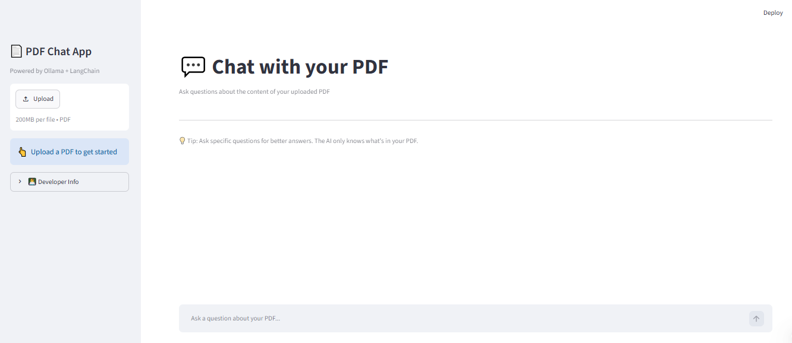
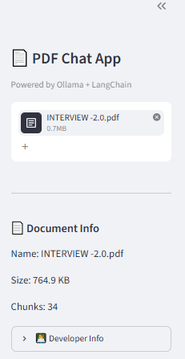
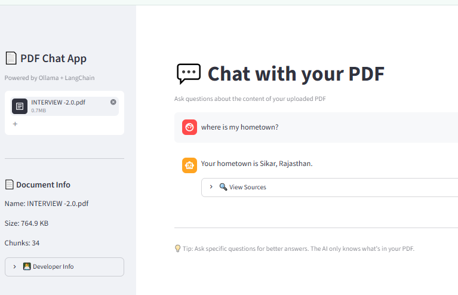
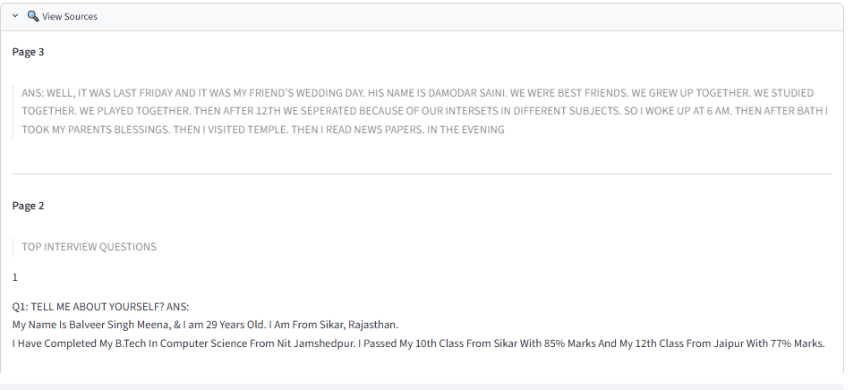

# AI PDF Chat

An intelligent, offline-first PDF chatbot that lets you upload any PDF and ask natural language questions about its content. Powered by Retrieval-Augmented Generation (RAG) with a local LLM (Ollama) and FAISS vector search for fast, accurate answers with source citations.


## Features

- 📄 **PDF Upload** – Drag & drop or browse any PDF file
- 💬 **AI Question Answering** – Ask questions in plain English
- 🔍 **RAG Pipeline** – Combines retrieval and generation for grounded responses
- 🦙 **Ollama Local LLM** – Runs Llama 3.2 (or other) entirely on your machine
- 🗄️ **FAISS Vector Search** – Fast similarity search over document embeddings
- 🧩 **Semantic Search** – Finds relevant chunks by meaning, not just keywords
- 📑 **Page Number Sources** – Every answer includes exact page references
- 🎨 **Clean Streamlit UI** – Modern, ChatGPT-inspired interface
- 💾 **Offline AI Processing** – No internet required after model download
- ⚡ **Fast Local Inference** – Optimized for low-latency responses

## Screenshots

| Home Screen | PDF Upload |
|-------------|------------|
|  |  |

| Answer View | Sources Panel |
|-------------|---------------|
|  |  |

*Replace placeholder images with actual screenshots in the `assets/` folder.*

## Architecture

```mermaid
flowchart TD
    A[User] --> B[Upload PDF]
    B --> C[Extract Text]
    C --> D[Split into Chunks]
    D --> E[Generate Embeddings]
    E --> F[FAISS Vector Store]
    F --> G[Retrieve Relevant Chunks]
    G --> H[LLM (Ollama)]
    H --> I[Answer with Sources]
    I --> A
```

### Workflow
1. **Upload** – User selects a PDF file via the Streamlit interface.
2. **Extract** – Text is pulled from each page using PyPDF.
3. **Chunk** – The raw text is split into overlapping segments for better context.
4. **Embed** – Each chunk is converted into a vector using a sentence‑transformer model.
5. **Store** – Vectors are indexed in a FAISS store for rapid similarity lookup.
6. **Retrieve** – Upon a query, the top‑k most relevant chunks are fetched.
7. **Generate** – The LLM (Ollama) receives the question + context and produces an answer.
8. **Cite** – Sources are returned with page numbers so users can verify the information.

## Tech Stack

| Category       | Technology          | Purpose |
|----------------|---------------------|---------|
| **Language**   | Python 3.9+         | Core logic |
| **Framework**  | Streamlit           | Interactive UI |
| **LLM**        | Ollama (Llama 3.2)  | Local language model |
| **Embeddings** | LangChain Ollama    | Text → vector |
| **Vector Store**| FAISS               | Similarity search |
| **PDF Parsing**| PyPDF               | Extract text from PDF |
| **Orchestration**| LangChain         | RAG pipeline components |
| **Version Control**| Git             | Source code management |

## Installation

Follow these steps to run the project locally.

```bash
# 1️⃣ Clone the repository
git clone https://github.com/lifechangerapp/ai-pdf-chat.git
cd ai-pdf-chat

# 2️⃣ Create a virtual environment
python -m venv venv
source venv/bin/activate   # Windows: venv\Scripts\activate

# 3️⃣ Install Python dependencies
pip install -r requirements.txt

# 4️⃣ Install Ollama (https://ollama.com)
#    macOS: brew install ollama
#    Linux: curl -fsSL https://ollama.com/install.sh | sh
#    Windows: Download installer from ollama.com

# 5️⃣ Pull the LLM model (run after Ollama installation)
ollama pull llama3.2

# 6️⃣ Launch the Streamlit app
streamlit run app.py
```

## Usage

1. **Upload a PDF** – Click “Browse files” in the sidebar and select a PDF.
2. **Wait for processing** – The app will extract text, create chunks, and build the vector store (status shown in sidebar).
3. **Ask a question** – Type your question in the chat input at the bottom and press Enter.
4. **View the answer** – The assistant’s response appears with a spinner while thinking.
5. **Check sources** – Expand the “🔍 View Sources” section to see the relevant chunks and their page numbers.

## Project Structure

```
ai-pdf-chat/
├─ app.py                 # Main Streamlit UI (only UI modifications allowed)
├─ chatbot.py             # LLM wrapper and question answering
├─ pdf_reader.py          # PDF text extraction
├─ text_splitter.py       # Chunking logic
├─ embeddings.py          # Embedding generation
├─ vector_store.py        # FAISS index creation/query
├─ query_rewriter.py      # Optional query rewriting for better retrieval
├─ requirements.txt       # Python dependencies
├─ README.md              # This file
└─ assets/                # Placeholder for screenshots
```

## Future Improvements

- 📚 **Multiple PDF Support** – Chat across several documents simultaneously
- 🕘 **Chat History** – Persist conversation across sessions
- 🔎 **Better Retrieval** – Hybrid search (BM25 + vector) and reranking
- 📤 **Export Chat** – Save conversation as Markdown or PDF
- 📱 **Android Client** – Native mobile interface using Kotlin/Java
- ⚡ **FastAPI Backend** – Decouple UI from core logic for scalability
- ☁️ **Cloud Deployment** – Dockerize and deploy to AWS/GCP/Azure
- 🎨 **Theme Customization** – Light/dark mode toggle and UI theming

## Contributing

Contributions are welcome! Please follow these steps:

1. Fork the repository.
2. Create a feature branch (`git checkout -b feature/amazing-feature`).
3. Commit your changes (`git commit -m "Add amazing feature"`).
4. Push to the branch (`git push origin feature/amazing-feature`).
5. Open a Pull Request.

Please ensure your code adheres to the existing style and includes appropriate tests.

## License

Distributed under the MIT License. See `LICENSE` for more information.

## Author

**Balveer Singh**  
GitHub: [@lifechangerapp](https://github.com/lifechangerapp)  
Email: [lifechanger051@gmail.com](mailto:lifechanger051@gmail.com)  

Feel free to reach out for collaborations, feedback, or job opportunities!